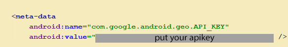
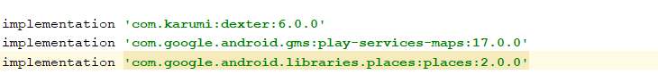
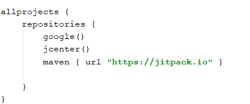
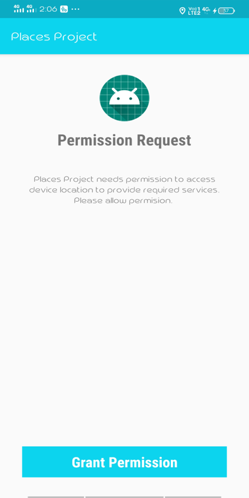
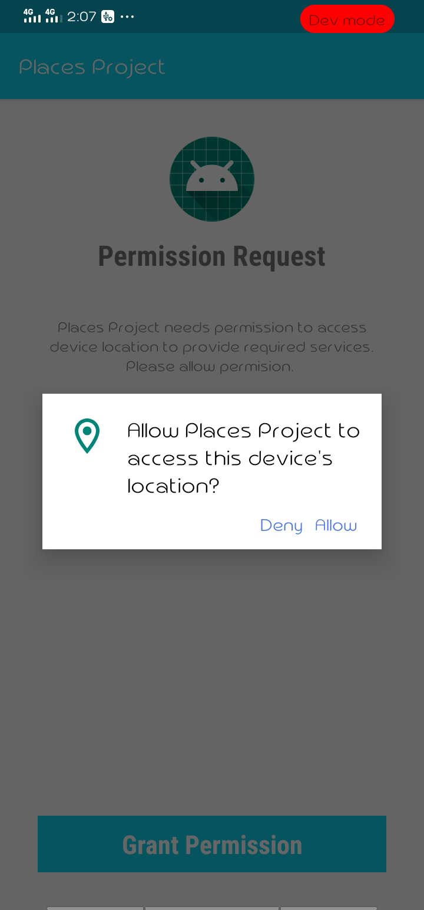
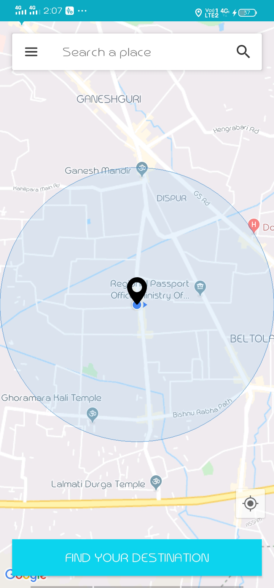
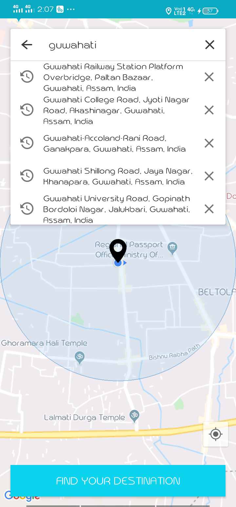
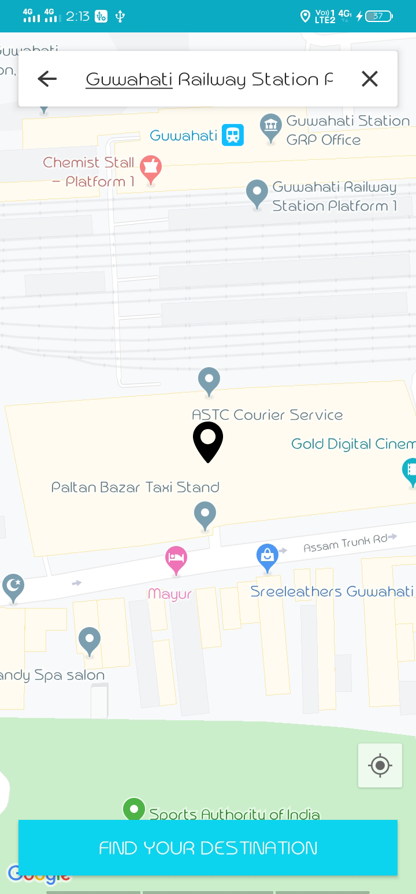

# Get-current-location-using-google-api-and-places-api

First, you need to create a Google API with apikey to login in GoogleAPI with your id. They provide you one apikey and put that in 
android manifests file using meta-data

## Dependency

--in `build.gradle` app

**Dexter** is an Android library that simplifies the process of requesting permissions at runtime.
The official API is heavily coupled with the Activity. 
Dexter free our permission code from your activities and lets you write that logic anywhere you want.

**Google play services map** allow us to use all google map features

**Library places** library allow us to search different places according to our search

--in `build.gradle` project

make sure **maven** library is added to our project

## Screenshots

Here I simple request the permission to access the device's location

     

After click `Allow`, it will directly bring to the MainActivity class where it shows the currect location of the user. If we click 
direction floating image right side   of the screen then it also shows the current loaction

In `Search a place` search bar we can also search the placeses by clicking on it.

After entering a place the navigation icon will directly jump to the searched place in the map.

